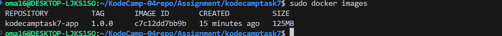

#  A web application development, containerizing it with Docker and deploying it to a Kubernetes cluster

## Simple Web Application

   - Used Python   

   - Created a file app.py [app.py](app.py)

## Containerized it with Docker

   - Created a file named Dockerfile in the same directory as app.py [Dockerfile](Dockerfile)

  

### Docker Image Build 

  - On the terminal and in the directory containing Dockerfile and app.py.
  - Built the image with a specific tag : docker build -t mydockerhubusername/kodecamptask7-app:1.0.0 .

   

   

   

   

   

   

   

### Run the Image Locally

   - Tested the image locally with docker run -p 8000:8000 mydockerhubusername/kodecamptask7-app:1.0.0

      
 
   - Tested in the web browser with http://localhost:8000 to see the application running.

      

### Push the Image to Docker Hub
   - Logged in to Docker Hub with "docker login"

   

   - Pushed the image with "docker push mydockerhubusername/kodecamptask7-app:1.0.0"
  
   

   

       -  Docker image URL [Docker image URL](https://hub.docker.com/r/oma16/kodecamptask7-app)

  - Got an error when dockerhubusername not included

   

## Deployed the Application to a Kubernetes Cluster

### Created Kubernetes Manifest Files

    - Created a file named deployment.yaml in the same directory as app.py 
    [deployment.yaml](deployment.yaml)

    - Created a file named service.yaml in the same directory as app.py 
    [service.yaml](service.yaml)

### Deployed to Minikube

   - Started minikube with minikube start -p "homelab" 

   -Created a namespace with "kubectl create ns kodecamp-app"

   

   - Apply the deployment and service
    
    - kubectl apply -f deployment.yaml -n kodecamp-app

        

        

        

        

        

        

    - kubectl apply -f service.yaml -n kodecamp-app

        

        - Service describe and get

            

            
        
### Port Forwarded to Access the Application
   - Forwarded the service port to a local port
    - kubectl -n kodecamp-app port-forward service/kodecamp-service 8080:80 

    

    - Tested in the web browser with http://localhost:8080 to see the application running.

    